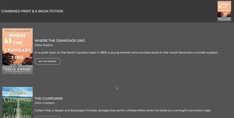
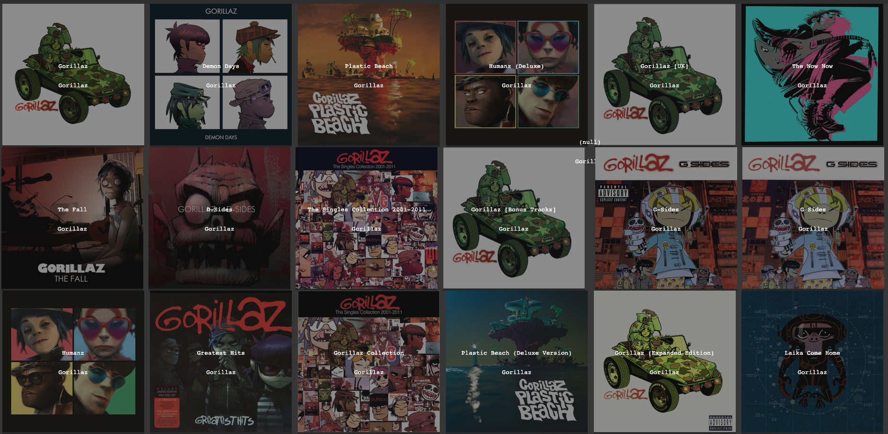
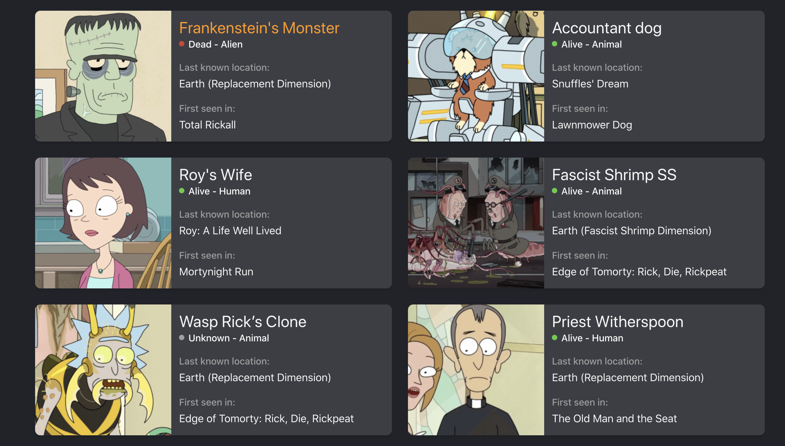

# SPA-props-and-lists-ex

Exercises to practice props and rendering lists

The purpose of this exercise is to practice basic react concepts.
I am providing you with some files with data that you can import in your components.

Please create a react application from scratch, clean it up and create a galerry of books or R&M characters or Gorillaz albums.

Or all of them!!

Concepts that you should look up/refresh and use:

List Rendering
Class components
Parent to child communication
Props
SCSS

Check the preview files for inspiration:

##### Books

##### Albums

##### Pickles

